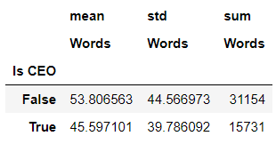
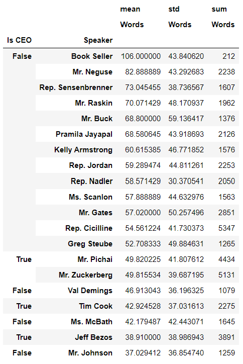
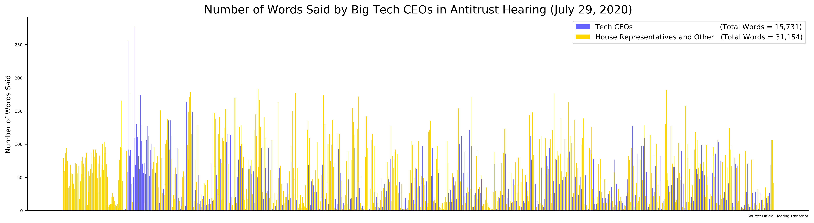
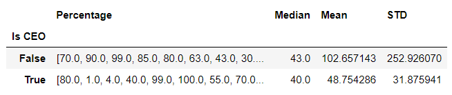
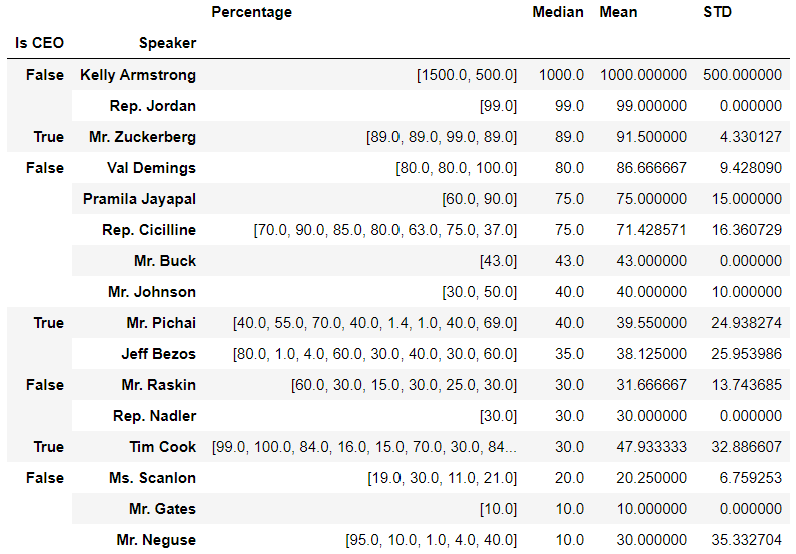
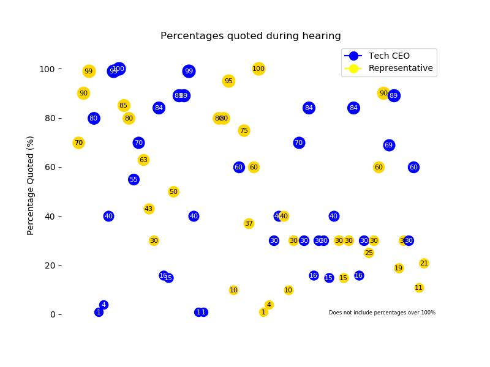

# Big Tech Hearing
A project analyzing quantitative statistics from the house judiciary committee's Big Tech hearing in July 2020

I undertook this project after watching the hearing, having made some anecdotal conclusions and wanting to see how the numbers came out. 
Firstly, I noticed that the house representatives rarely gave the CEOs time to speak, and wanted to see how the data on numbers of words 
spoken by the two groups compared. Secondly, I noticed that there seemed to be many cases where the representatives used large percentages
to describe the big tech companies especially in regards to market share, to which the CEOs seemed to often respond with smaller percentages 
that painted their companies in a different light. To test these hypotheses, I downloaded the transcripts of the hearing and analyzed the 
text in a jupyter notebook. 

## Words Spoken
As you can see from the following data, the CEOs spoke half as many words as the representatives, and averaged about 8 less words per 
statement. This disparity is made even more clear by the fact that  12 representatives averaged more time speaking per statement than any CEO. 

By category:

By speaker:

The following graph visualizes the length at which each person spoke in terms of words:

## Percentages Quoted
When it comes to the percentages quoted in the hearing, however, my hypothesis that the CEOs would have lower percentages quoted on average
did not hold up. While the average percentage quoted by the representatives was much higher, this is in large part due to two extravagant
percentages quoted by Kelly Armstrong, and the median percentages of the two groups fall within 3 points of each other.

By category:

By speaker:

This graph shows the percentages quoted throughout the hearing:

